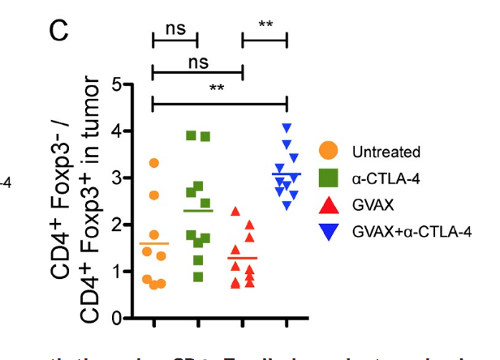
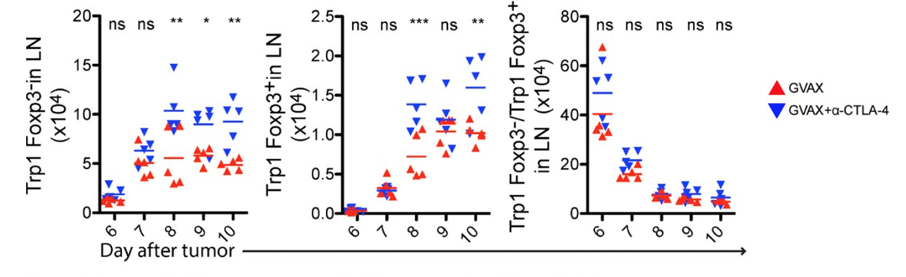
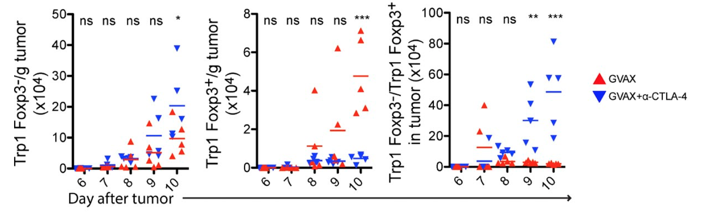
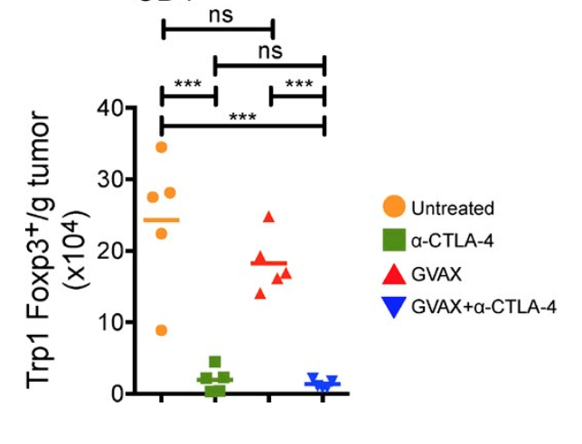
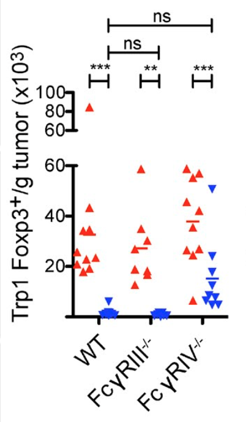

```{r setup, echo=FALSE}
library(ggplot2)
library(ggpubr)
library(data.table)
library(MASS)
```

# Flow of experiments
cell key: CD4+Foxp3- Teff; CD4+Foxp3+ Treg

1. Q. Does alpha-CTLA-4 protect against tumor growth and increase survival? A: Yes, but only in combination with GVAX. Fig 1. 2 x 2 combination of GVAX and alpha-CTLA-4 on tumor growth in C57BL/6 wild-type and I-A-/- (no CD4+ T cell compartment) mouse lines. Combination treatment (but not either in isolation) "protected against" tumor growth in wild but not -/- mice, indicating CD4+ T cell required for protection. Supported with Fig 1B survival curve and Fig 1C dot/mean plots and t/posthoc tests

2a) Q. Is there tissue-specifiec effect of alpha-CTLA-4 on Teff or Treg counts and ratio? A. Yes in lymph node both Teff and Treg increase regardless of treatment but Treg increases faster so Teff/Treg drops over duration. But in tumor, Fig 2. 50,000 Trp1 Tcells introduced to track growth of Teff and Treg. In lymph node, both types increased over the 10 days, regardless of GVAX+/CTLA+ but Treg increased more so Teff/Treg decreased over duration. In tumor, both types increased with only GVAX+ but Treg decreased with GVAX+/CTLA+ so Teff/Treg ratio increased. b) Reduction in Treg with GVAX-/CTLA+ indicating that GVAX isn't necessary (me: not super consistent with the no obvious pattern of ratio for GVAX-/CTLA+ in Fig. 1C.).  Supported with dot/mean plots and t/posthoc tests.

3) Fig 3. three different CTLA clones also show Treg suppression (me: only 2?). Supported with dot/mean plots and t/posthoc tests.

4) mice treated with alpha-CTLA-4 throughout the 10 days or with a single dose on day 10, Both show large reduction in Treg.

# Experiment 1
 

2 x 2 combination of GVAX and alpha-CTLA-4 on tumor growth in C57BL/6 wild-type and I-A-/- (no CD4+ T cell compartment) mouse lines. Combination treatment (but not either in isolation) "protected against" tumor growth in wild but not -/- mice, indicating CD4+ T cell required for protection.

Treatment key: -/- control; +/- alpha-CTLA-4; -/+ GVAX; +/+ both
cell key: CD4+Foxp3- Teff; CD4+Foxp3+ Treg

Fig. 1C is the effect of treatment on Neff/Nreg, the ratio of number of effector (Tc) to regulatory (Treg) cells. Thoughts

1. Means but no SE or CI presented.
2. presented as 4 levels instead of 2 x 2 (this seems to be a graphpad prism thing)
3. what is the effect of the distribution of the response (a ratio of counts) on t-tests?
4. F-/- ratio = 1.5, +/+ ratio is 3. Only seem to care about "an effect" with no sense of effect size importance of this effect size or what the minimal effect to care is. For example what if the pattern were maintained with bigger sample and "significant" increase in +/-? How would this effect interpretation of mechanism?

```{r experiment 1}
library(ggplot2)
library(data.table)
library(MASS)
niter <- 5000
b1 <- 0
mu_reg.cn <- 10^4
mu_eff.cn <- mu_reg.cn*1.5
mu_reg.trt <- mu_reg.cn*10
mu_eff.trt <- mu_reg.trt*(1.5+b1)
theta <- 5
n <- 10
p_table <- matrix(NA, nrow=niter, ncol=2)
colnames(p_table) <- c("t", "wilcoxon")
ratio_table <- matrix(NA, nrow=niter, ncol=2)
colnames(ratio_table) <- c("cn", "trt")
for(iter in 1:niter){
  # are N_reg and N_eff correlated within individuals?
  N_reg.cn <- rnegbin(n, mu=mu_reg.cn, theta=theta)
  N_eff.cn <- rnegbin(n, mu=mu_eff.cn, theta=theta)
  N_reg.trt <- rnegbin(n, mu=mu_reg.trt, theta=theta)
  N_eff.trt <- rnegbin(n, mu=mu_eff.trt, theta=theta)
  ratio.cn <- N_eff.cn/N_reg.cn
  ratio.trt <- N_eff.trt/N_reg.trt
  ratio_table[iter,] <- c(mean(ratio.cn), mean(ratio.trt))
  p_table[iter, 1] <- t.test(ratio.cn, ratio.trt, var.equal = FALSE)$p.value
  
  fd <- data.table(N_reg=c(N_reg.cn, N_reg.trt), 
                   N_eff=c(N_eff.cn, N_eff.trt), 
                   treatment=rep(c("cn", "trt"), each=n))
  p_table[iter, 2] <- wilcox.test(ratio.cn, ratio.trt)$p.value
}
apply(ratio_table, 2, mean)
apply(p_table, 2, function(x) length(which(x <= 0.05))/niter)
```


# Experiment 2


"alpha-CTLA-4 increased the absolute numbers of both [Teff and Treg] populations, without changing the Teff/Treg cell ratio""

1. clear increase variance with mean although the tests are not across days, which contain biggest variation in variance
2. Conclusion of no difference in ratio between -/+ and +/+ based on p > 0.05. Does this matter? What if the ratio were different? Would it effect the interpretation? Or is it just description?



1. again, clear increase variance with mean.
2. again, only care about effects With n=5 the p-values are unlikely to be significant without big effect. Example is middle plot at 9 days. Note sampling from Normal is unlikely to give response at 9 days of middle plot (unlikely to sample 2 outliers).


# Experiment Fig. 7

```{r experiment 7d}
mu_1 <- 4*10^4
mu_2 <- 12*10^4
beta_1 <- mu_2 - mu_1
n <- 10
niter <- 1000
treatment_levels <- c("WT", "FcgRIV--")
treatment <- factor(rep(treatment_levels, each=n), treatment_levels)
X <- model.matrix(~treatment)
mu <- rep(c(mu_1, mu_2), each=n)
theta <- 3
fd <- data.table(Treatment=treatment, y=NA)
models <- c("t", "Welch", "Wilcoxan", "glm")
p_table <- matrix(NA, nrow=niter, ncol=length(models))
colnames(p_table) <- models
for(iter in 1:niter){
  fd[, y:=rnegbin(2*n, mu=mu, theta=theta)]
  p_table[iter, "t"] <- t.test(y~Treatment, data=fd, var.equal=TRUE)$p.value
  p_table[iter, "Welch"] <- t.test(y~Treatment, data=fd, var.equal=FALSE)$p.value
  p_table[iter, "Wilcoxan"] <- wilcox.test(y~Treatment, data=fd)$p.value
  fit <- glm.nb(y~Treatment, data=fd)
  p_table[iter, "glm"] <- coef(summary(fit))["TreatmentFcgRIV--", "Pr(>|z|)"]
}
ggerrorplot(x="Treatment", y="y", data=fd, desc_stat = "mean", add=c("jitter"))
apply(p_table, 2, function(x) length(which(x <= 0.05))/niter)

```

