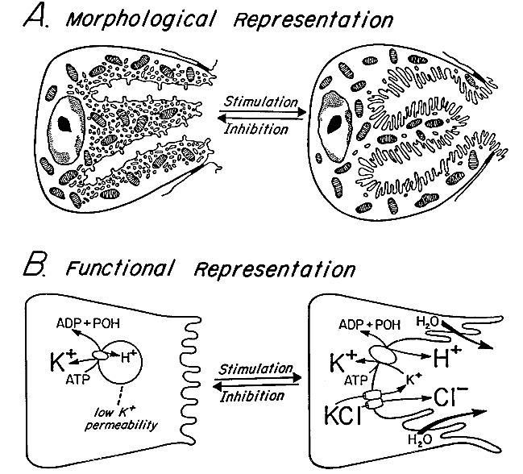

# Digestive
## Absorption
### Carbohydrate absorption in the mouth and intestine
There are some misconceptions that "fast-acting" glucose xxx
## Stomach
### Parietal cells
#### Proton pump inhibitors
```{r parietalcell, echo=FALSE,out.width = "50%", fig.cap="Parietal cell of stomach epithelium. This is beautiful. The apical side is involuted into *canaliculi* (little canals) that increase surface area for secretion of H+ by the proton pumps. The canaliculi have microvilli. The morphology of the canaliculi is food dependent. From https://mcb.berkeley.edu/labs/forte/morphol.html"}

```

[Proton pump inhibitors](https://en.wikipedia.org/wiki/Proton-pump_inhibitor) (PPI) bind to and inhibit the H$^+$/K$^+$ ATPase proton pump, which are expressed on the apical surface of parietal cells. See figure \@ref[fig parietalcell] for the morphology of this cell. PPIs are taken orally but take a circuitous route to the parietal cells and proton pumps. That is, they transit through the stomach to the small intestine where they are absorbed (my guess: because of the mucus coating of the stomach they simply have little access to the parietal cells deep in the [gastric glands](https://en.wikipedia.org/wiki/Gastric_glands) PPIs are lipophilic in the neutral environment and cross the plasma membrane of the enterocytes. The [wikipedia entry figure](https://en.wikipedia.org/wiki/Proton-pump_inhibitor#/media/File:Proton_pump_inhibitors_mechanism.svg) suggests that the PPI is metabolized in the cell and binds to the pump on the cytyplasmic side of the protein. However, this excerpt^["Proton pump inhibitors are weak bases carried in the circulation and delivered to the parietal cell as prodrugs. In this form, PPIs are capable of crossing cell membranes. The parietal cell is the only membrane‐enclosed space in the body with a pH below 4.0 [**note from Jeff: This is poorly written. The cytoplasm doesn't have low pH. Instead, the low pH (about 1.0 or less) is in the canlicular space, which is outside the cell but enclosed by parietal cell membrane -- see figure**]. In this acidic environment of pH ∼1.0, PPIs accumulate in the secretory canaliculus of the parietal cell – at the luminal side of the gastric H+K+‐ATPase – as a result of protonation of the pyridine moiety, which renders them less membrane permeable. It is likely that the monoprotonated species binds directly to the pump. Once on the acidic surface of the pump (or in the acid compartment), PPIs undergo a second protonation on the benzimidazole or imidazopyridine moiety that effects a chemical rearrangement involving nucleophilic attack on the (unprotonated) pyridine by the now electrophilic 2C of the protonated benzimidazole, producing a planar cationic sulfenic acid.4, 5 This thiophilic cation, or the sulfenamide form produced by dehydration of the sulfenic acid, is the active form of the drug that reacts with cysteine sulfhydryls on the pump to form one or more covalent disulphide bonds, thus inhibiting its activity. The need for these two protonation steps in the accumulation and activation of PPIs and the particular chemical requirements underlying them mean that the covalent reaction that inhibits the ATPase is specific to the active gastric H+K+‐ATPase with a very large margin of safety given the pH of activation (≤2.0–2.5)" -- Sachs, G., Shin, J.M. and Howden, C.W., 2006. The clinical pharmacology of proton pump inhibitors. Alimentary pharmacology & therapeutics, 23(s2), pp.2-8. -- see also Shin, J.M. and Kim, N., 2013. Pharmacokinetics and pharmacodynamics of the proton pump inhibitors. Journal of neurogastroenterology and motility, 19(1), p.25.] states that the PPI diffuses across the apical membrane into the canalicular space where it is protanated (because of the low pH in this space because this is where the proton pumps are pumping H$^+$!), which makes it less permeable. Here the PPI binds to the luminal side of the proton pump.
